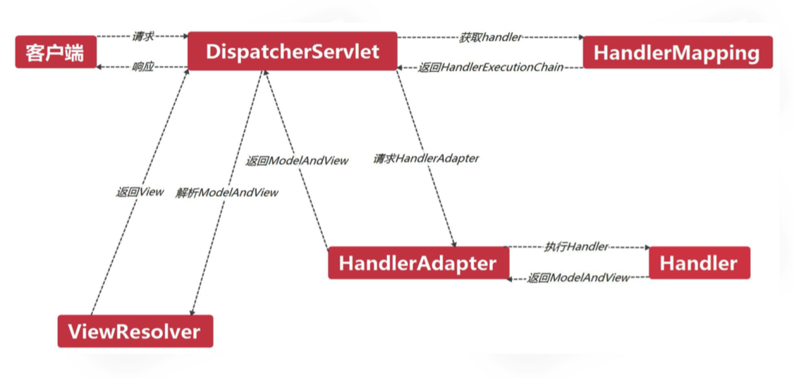

## SpringMVC核心组件

* DispatcherServlet:前置控制器

* HandlerMapping:将请求映射到Handler

* Handler:后端控制器,完成具体业务逻辑

* HandlerInterceptor:处理器拦截器

* HandlerExecutionChain:处理器执行链

* HandlerAdapter:处理器适配器

* ModelAndView:装载模型数据和视图信息

* ViewResolver:视图解析器

## SpringMVC实现流程

* 客户端请求被DispatcherServlet接收

* DispatcherServlet将请求映射到Handler

* 生成Handler以及HandlerInterceptor

* 返回HandlerExecutionChain(Handler+HandlerInterceptor)

* DispatcherServlet通过HandlerAdapter执行Handler

* 返回一个ModelAndView

* DispatcherServlet通过ViewResolver进行解析

* 返回填充了模型数据的View,响应给客户端

